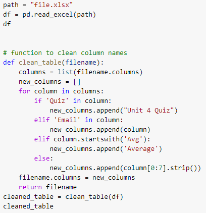
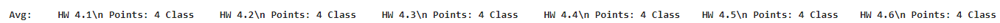
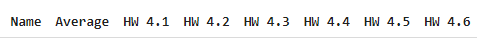
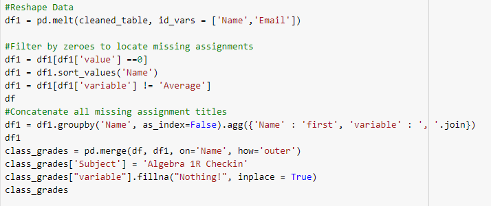
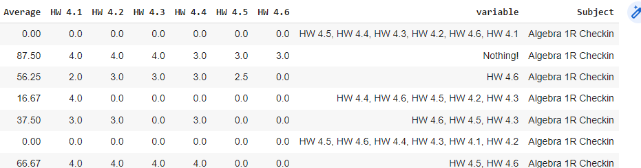

# What Got Me HOOKED on Data Science

Introduction – Why data?!

The data world is a rapidly growing and evolving industry. Many data points are used in problem solving for our most impactful economic and cultural issues. The use of data enables an entity to answer very complex questions and encourage careful consideration for that entity’s future. As an educator, I use data frequently to inform my instruction and planning. Keeping a strict schedule for learning requires that any learning gaps are addressed immediately. With over 100 students the ability to aggregate and use the data collected can be quite time consuming.

My Background and Why I Learned to Code

I am a certified math teacher at the secondary level(grades 7-12). I have taught advanced classes at all levels, from the seventh grade accelerated course all the way up to Calculus I through concurrent enrollment at our local community college. Since I had a strong background in mathematics, I was interested in how I could use technology to improve on certain aspects of my job. I also figured, why not know some coding so that I could educate my calculus students who are interested in engineering or computer science, or even my more techy students at the lower grade levels.

I began to learn to code about eight months ago. I wanted to learn about using coding to make parts of my job easier and more efficient. I worked through several tutorials involving the pandas library for answering problems using data analysis. In these tutorials, I learned how to use pandas to clean, filter, and aggregate data, create visuals with matplotlib, and even implemented some machine learning models with Natural Language Processing and Image classification. I found all of these projects fascinating and incredibly useful.

I decided that this school year I would try to use coding to improve my professional development to make me better at my job, and so far the use of programs like python and excel has been a large part of how my job has improved.

The problem to solve – Parent Communication

A coworker of mine was a math teacher with a Computer Science degree and he told me about how he uses javascript and google sheets to send custom emails out to parents. The email contains things like the students average, every asssignment the are missing, and even a comment on how they are behaving in class. I decided since I found out about this, that I wanted to create the same thing so I could have better communication with my families.


My first project – The Email Bot!

My first project involving data was a spreadsheet email bot. With the use of python pandas, I compile and automate spreadsheets containing grade information. They are then turned into APIs that I access to send out customized grade reports in the form of an email to every student’s parent. I find that this where I get the most engagement out of parents and their child’s progress. I went from contacting about 10-15 parents regularly each year to contacting all of them(over 100!).

The process that was described above seems very simple, but there is a lot behind the scenes that happens. The data needs to be prepped, cleaned, and formatted in a specific way to be sent out in an email in an efficient manner. Along with this, the setup of the software itself was a learning experience. Learning about permissions, linking directories in a new environment, and sending them to new formats all are initially a process of learning.

Cleaning the Table

The grade report is generated through data taken from a school website that doesn’t export in a spreadsheet that is “friendly” with an emailer. The dataframe needs to be cleaned, reformatted for readability. This is done through a function built in python using a jupyter notebook in google colab.



#### This function made the column names go from this format:


#### To this format:



### Compiling the Missing Assignments

After the table is cleaned, the data is then reshaped to add a column containing a list of the missing assignments for each student.


Here the column “variable” represents their missing assignments. The code above first reshapes the data so that each assignment is aligned with the score. Then, the dataframe is filtered by all assignments that have a grade of 0(meaning it is missing), and then the assignment names are merged together, and that column is merged with the original dataframe.

In addition, a subject for the email is added to the dataframe for when it is transferred.


After the table was prepped, it then was ready to be accessed by the email server to send out. The email was crafted in python with text formatters and the customary information was looped through and extracted from the spreadsheet(as an API) and inserted into each sent email.

The email code was utilized with the smtplib and requests libraries. Smtplib is the library used to send the emails, with the use of a for loop to iterate through each row in the dataframe(as an API).

Before the use of python, I have used other data tools like excel spreadsheets to check for important accountant information at school, create labels for student materials, and general statistics on test results. This project gave me a new capability to communicate these important results to any group of people with just the run of a few cells.

## Moving Forward

The email app is definitely a successful tool in my work, but I am looking to make improvements. There are pieces that can be made more efficiently to streamline and improve the quality of the process.

#1 – The Clean table function

There are a few ways to improve this part of the process. For one, the clean table function needs to be edited every time grade reports are imported. A more intuitive function can be written so that edits don’t need to be made every time.

#2 – Efficiency of xlsx imports

In addition to this, there is currently an import of each classes grade sheet. This causes the code to have to run separately for each class. This is fine if only a few classes need to have their tables cleaned, but a for loop can be used to iterate through all the xlsx files if there are several jobs to implement.

#3 – API Spreadsheets

One piece that is needed to send out the email is the use the API spreadsheets website. This adds a few steps to the process, as the spreadsheets needs to uploaded as an API individually. Once again, this can be possibly iterated through or by some other process to streamline the uploads, or cut out the use of API spreasheets entirely.

## Conclusion

I enjoyed developing this project! The journey in creating and implementing this project was a learning process from beginning to end. The result was a useful deliverable that benefits myself and the families I work with, encouraging communication on their childs academics. This project added so much value to my job as I now have a way to contact hundreds of parents through the use of automation.

The use of pandas, pythonic functions, and learning about API servers was invaluable. Having that personal stake in the task itself caused me to want to know more efficient methods of code and expanded my knowledge of how I can manipulate a dataframe. I also learned about the setup of google colab which allows me to code with the advantage of using google drive. This allows me to access all of my google formatted spreadsheets without the need of a 3rd party IDE.

This project will have updates that will make the process more efficient, intuitive and versatile. I am confident that I will be able to use this code in future workplaces and apply it in a beneficial way for my institution. I hope to be able to eventually automate some of the “clunkier” aspects of the program and continue to build more professional looking emails every time they are sent out.


```python

```
